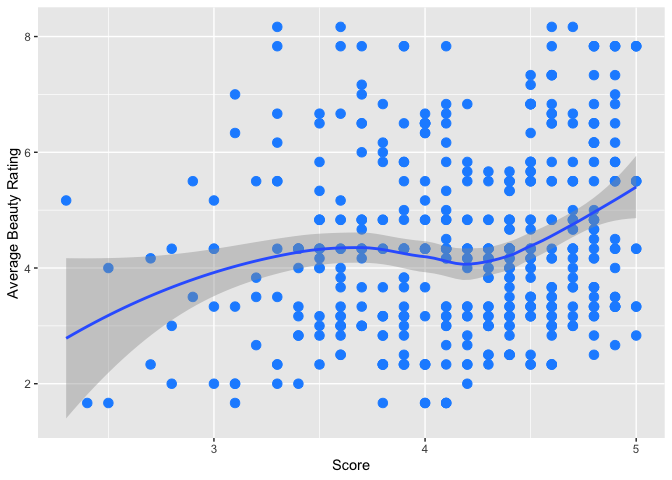

Lab 09 - Grading the professor, Pt. 1
================
Insert your name here
Insert date here

### Load packages and data

``` r
library(tidyverse) 
library(openintro)
library(broom)

?evals

?score
```

    ## No documentation for 'score' in specified packages and libraries:
    ## you could try '??score'

Exercises Part 1: Exploratory Data Analysis Visualize the distribution
of score. Is the distribution skewed? What does that tell you about how
students rate courses? Is this what you expected to see? Why, or why
not? Include any summary statistics and visualizations you use in your
response.

------------------------------------------------------------------------

\#Excercise 1

``` r
evals %>% 
  ggplot(aes(x = score)) +
  geom_bar()
```

<!-- -->

``` r
summary(evals$score)
```

    ##    Min. 1st Qu.  Median    Mean 3rd Qu.    Max. 
    ##   2.300   3.800   4.300   4.175   4.600   5.000

Visualize and describe the relationship between score and the variable
bty_avg, a professor’s average beauty rating.

Hint: See the help page for the function at
<http://ggplot2.tidyverse.org/reference/index.html>.

Replot the scatterplot from Exercise 3, but this time use geom_jitter()?
What does “jitter” mean? What was misleading about the initial
scatterplot? Part 2: Linear regression with a numerical predictor
Recall: Linear model is in the form  
^ y = b 0 + b 1 x .

Let’s see if the apparent trend in the plot is something more than
natural variation. Fit a linear model called m_bty to predict average
professor evaluation score by average beauty rating (bty_avg). Based on
the regression output, write the linear model.

Replot your visualization from Exercise 3, and add the regression line
to this plot in orange color. Turn off the shading for the uncertainty
of the line.

Interpret the slope of the linear model in context of the data.

Interpret the intercept of the linear model in context of the data.
Comment on whether or not the intercept makes sense in this context.

Determine the  
R 2 of the model and interpret it in context of the data.

Part 3: Linear regression with a categorical predictor Fit a new linear
model called m_gen to predict average professor evaluation score based
on gender of the professor. Based on the regression output, write the
linear model and interpret the slope and intercept in context of the
data.

What is the equation of the line corresponding to male professors? What
is it for female professors?

Fit a new linear model called m_rank to predict average professor
evaluation score based on rank of the professor. Based on the regression
output, write the linear model and interpret the slopes and intercept in
context of the data.

Create a new variable called rank_relevel where “tenure track” is the
baseline level.

Fit a new linear model called m_rank_relevel to predict average
professor evaluation score based on rank_relevel of the professor. This
is the new (releveled) variable you created in Exercise 13. Based on the
regression output, write the linear model and interpret the slopes and
intercept in context of the data. Also determine and interpret the  
R 2 of the model.

Create another new variable called tenure_eligible that labels
“teaching” faculty as “no” and labels “tenure track” and “tenured”
faculty as “yes”.

Fit a new linear model called m_tenure_eligible to predict average
professor evaluation score based on tenure_eligibleness of the
professor. This is the new (regrouped) variable you created in Exercise
15. Based on the regression output, write the linear model and interpret
the slopes and intercept in context of the data. Also determine and
interpret the  
R 2 of the model.
