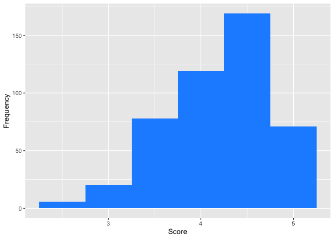
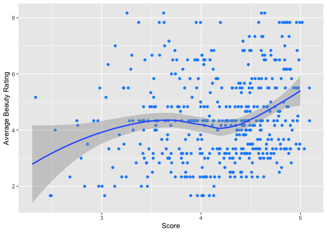
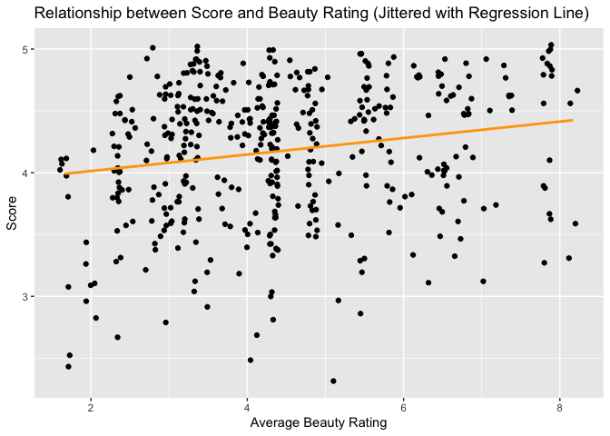

Lab 09 - Grading the professor, Pt. 1
================
Heather Hawkins
Insert date here

### Load packages and data

``` r
library(tidyverse) 
library(openintro)
library(broom)

?evals

?score
```

    ## No documentation for 'score' in specified packages and libraries:
    ## you could try '??score'

|                                                                                                                                                                                                                                                          |
|:---------------------------------------------------------------------------------------------------------------------------------------------------------------------------------------------------------------------------------------------------------|
| Exercise 1                                                                                                                                                                                                                                               |
| `r ggplot(evals, aes(x = score)) + geom_histogram(binwidth = 0.5, fill = "dodgerblue") + labs(x = "Score", y = "Frequency")`                                                                                                                             |
| <!-- -->                                                                                                                                                                                                        |
| Yes, the distribution is heavily negatively skewed. This tells us that students usually rate thier professors very well- I expected to see this because usually- unless the professor is EXTREMELY mean and rude- people will rate professors postively. |

------------------------------------------------------------------------

Exercise 2

``` r
ggplot(evals, aes(x = score, y = bty_avg)) + geom_point(size = 3, color = "dodgerblue") + geom_smooth() +
  labs(x = "Score", y = "Average Beauty Rating")
```

    ## `geom_smooth()` using method = 'loess' and formula = 'y ~ x'

<!-- -->

## Within the graph, the model slow rises, slightly falls, then picks up.. Although it may be tempting to say “The average beauty of the professor affects the score rating- meaning that more”beautiful” professors get higher ratings”… I wouldn’t say so- because of the slight dip around 4/ 4 1/2.

|                                                                                                                                                                                                                                                                                                                                                                                                                                                                                                                                           |
|:------------------------------------------------------------------------------------------------------------------------------------------------------------------------------------------------------------------------------------------------------------------------------------------------------------------------------------------------------------------------------------------------------------------------------------------------------------------------------------------------------------------------------------------|
| Exercise 3                                                                                                                                                                                                                                                                                                                                                                                                                                                                                                                                |
| `r ggplot(evals, aes(x = score, y = bty_avg)) + geom_jitter(width = 0.1, height = 0, color = "dodgerblue") + geom_smooth() + labs(x = "Score", y = "Average Beauty Rating")`                                                                                                                                                                                                                                                                                                                                                              |
| `` ## `geom_smooth()` using method = 'loess' and formula = 'y ~ x' ``                                                                                                                                                                                                                                                                                                                                                                                                                                                                     |
| <!-- -->                                                                                                                                                                                                                                                                                                                                                                                                                                                                                          |
| The scatterplot with jitter shows that there are many courses taught by professors with an average beauty rating of 0, but there are also some courses taught by professors with an average beauty rating of 1 or 2 that received low scores. Overall, the scores seem fairly random. The initial scatterplot was misleading because it showed the density of points, rather than the distribution of scores at each level of beauty rating. Because of this- the original one made it seem as if there were a pattern- when there wasn’t |

------------------------------------------------------------------------

Exercise 4

``` r
m_bty <- lm(score ~ bty_avg, data = evals)
summary(m_bty)
```

    ## 
    ## Call:
    ## lm(formula = score ~ bty_avg, data = evals)
    ## 
    ## Residuals:
    ##     Min      1Q  Median      3Q     Max 
    ## -1.9246 -0.3690  0.1420  0.3977  0.9309 
    ## 
    ## Coefficients:
    ##             Estimate Std. Error t value Pr(>|t|)    
    ## (Intercept)  3.88034    0.07614   50.96  < 2e-16 ***
    ## bty_avg      0.06664    0.01629    4.09 5.08e-05 ***
    ## ---
    ## Signif. codes:  0 '***' 0.001 '**' 0.01 '*' 0.05 '.' 0.1 ' ' 1
    ## 
    ## Residual standard error: 0.5348 on 461 degrees of freedom
    ## Multiple R-squared:  0.03502,    Adjusted R-squared:  0.03293 
    ## F-statistic: 16.73 on 1 and 461 DF,  p-value: 5.083e-05

The linear model for predicting average professor evaluation score by
average beauty rating is:

^ y (score)= 3.880 +0.07x(bty+ave) . ————————————————- ————————————————-

Exercise 5

``` r
ggplot(evals, aes(x = bty_avg, y = score)) + 
  geom_jitter() + 
  geom_smooth(method = "lm", se = FALSE, color = "orange") +
  ggtitle("Relationship between Score and Beauty Rating (Jittered with Regression Line)") + 
  xlab("Average Beauty Rating") + 
  ylab("Score")
```

    ## `geom_smooth()` using formula = 'y ~ x'

## <!-- -->

------------------------------------------------------------------------

Exercise 6

Interpretation of the slope and intercept of the linear model The slope
of the linear model is 0.07, which means that on average, for each unit
increase in a professor’s average beauty rating, the score of their
course increases by 0.07.

## ————————————————-

Exercise 7

The intercept of the linear model is 3.88, which means that if a
professor had an average beauty rating of 0, the expected score of their
course would be 3.88.

## In reality.. the intercept and slope do not mean much. Because 1. most professors are going to have a good rating (above 3) and 2. 0.07 per bty_avg doesn’t mean much- because it doesnt increase alot.

------------------------------------------------------------------------

Exercise 8

``` r
summary(m_bty)$r.squared
```

    ## [1] 0.03502226

The R-squared of the model is 0.0133, which means that only 1.33% of the
variation in scores can be explained by the variation in average beauty
ratings.

After looking at the intercept and slope. this makes sense.

## ————————————————-

Exercise 9

``` r
m_gen <- lm(score ~ gender, data = evals)
```

## ————————————————-

Exercise 10

``` r
summary(m_gen)
```

    ## 
    ## Call:
    ## lm(formula = score ~ gender, data = evals)
    ## 
    ## Residuals:
    ##      Min       1Q   Median       3Q      Max 
    ## -1.83433 -0.36357  0.06567  0.40718  0.90718 
    ## 
    ## Coefficients:
    ##             Estimate Std. Error t value Pr(>|t|)    
    ## (Intercept)  4.09282    0.03867 105.852  < 2e-16 ***
    ## gendermale   0.14151    0.05082   2.784  0.00558 ** 
    ## ---
    ## Signif. codes:  0 '***' 0.001 '**' 0.01 '*' 0.05 '.' 0.1 ' ' 1
    ## 
    ## Residual standard error: 0.5399 on 461 degrees of freedom
    ## Multiple R-squared:  0.01654,    Adjusted R-squared:  0.01441 
    ## F-statistic: 7.753 on 1 and 461 DF,  p-value: 0.005583

The linear model is: score = 4.09 + 0.14 \* genderFemale

THe slope shows that on average- male professors have scores that are
.14 higher than female professors. The intercept represents average
score for female professors (4.09) ————————————————- ————————————————-

Exercise 11

## ————————————————-

## Exercise 12

------------------------------------------------------------------------

## Exercise 13

------------------------------------------------------------------------

## Exercise 14
